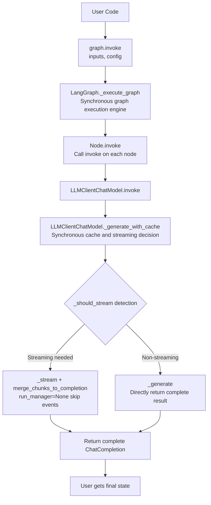
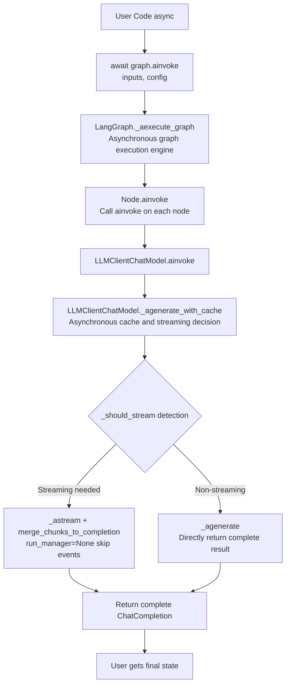
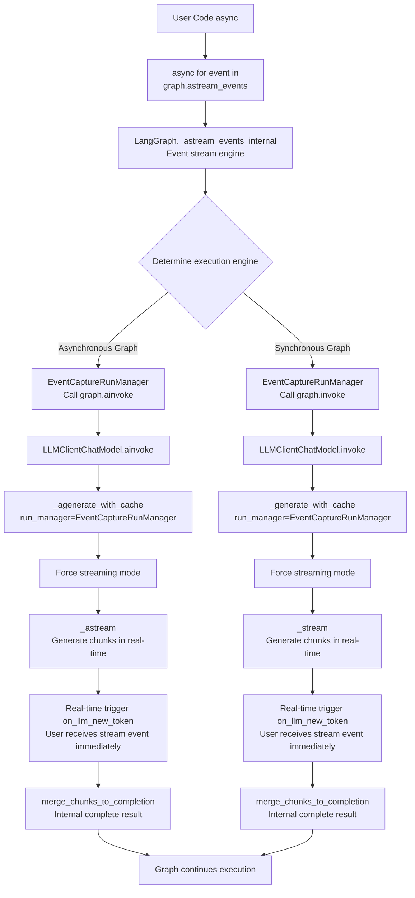

# BaseAgent Advanced Development Guide

## 1. Deep Integration of Custom LLMClient and LangGraph Unified Execution Mechanism

### 1.1 Core Component Architecture

#### 1.1.1 `LLMClientChatModel` Class Structure

```python
class LLMClientChatModel(BaseChatModel):
    """Wraps LLMClient as a LangChain ChatModel, supporting custom message types"""
    llm_client: LLMClient = Field(..., description="LLM client instance")
    
    # Core methods
    _generate()      # Synchronous non-streaming
    _stream()        # Synchronous streaming  
    _agenerate()     # Asynchronous non-streaming
    _astream()       # Asynchronous streaming
    _generate_with_cache()    # Synchronous cache and streaming decision
    _agenerate_with_cache()   # Asynchronous cache and streaming decision
```

#### 1.1.2 Custom Message Types

```python
# Supports passing full OpenAI-native ChatCompletion / ChatCompletionChunk objects
ChatMessage(content="", chat_completion=response)
ChatMessageChunk(content="", chat_completion_chunk=chunk)
merge_chunks_to_completion  # Function supporting merging ChatCompletionChunk stream into ChatCompletion response
```

### 1.2 LangGraph Unified Execution Mechanism

#### 1.2.1 Synchronous Graph Execution Flow (`graph.invoke` core call chain)



#### 1.2.2 Asynchronous Graph Execution Flow (`graph.ainvoke` core call chain)



#### 1.2.3 Synchronous/Asynchronous Graph Event Stream Execution Flow (`graph.astream_events` core call chain and event mechanism)



### 1.3 LangGraph Integration Call Details

#### 1.3.1 Synchronous Graph Non-streaming Call: `graph.invoke`

```python
class MyAgent(BaseAgent):
    def _build_graph(self):
        graph = StateGraph(AgentState)
        
        def llm_node(state: AgentState):
            # Get LLMClientChatModel instance
            llm_client = self.get_llm_client()
            chat_model = LLMClientChatModel(llm_client=llm_client)
            
            # Synchronous call
            result = chat_model.invoke(state["messages"])
            return {**state, "response": result}
        
        graph.add_node("llm_node", llm_node)
        return graph.compile()

# Usage
agent = MyAgent()
result = agent.graph.invoke({"messages": [HumanMessage(content="Hello")]})
```

#### 1.3.2 Asynchronous Graph Non-streaming Call: `graph.ainvoke`

```python
async def llm_node(state: AgentState):
    llm_client = self.get_llm_client()
    chat_model = LLMClientChatModel(llm_client=llm_client)
    
    # Asynchronous call
    result = await chat_model.ainvoke(state["messages"])
    return {**state, "response": result}

# Usage
result = await agent.graph.ainvoke({"messages": [HumanMessage(content="Hello")]})
```

#### 1.3.3 Synchronous/Asynchronous Graph Streaming Call: `graph.astream_events`

```python
async def run_stream(self, input_data: str, **kwargs):
    """Advanced streaming implementation"""
    config = {"configurable": kwargs}
    
    async for event in self.graph.astream_events(
        {"input": input_data}, 
        config=config, 
        version="v1"
    ):
        event_type = event.get("event", "")
        
        # Listen for LLM streaming events
        if event_type == "on_chat_model_stream":
            chunk = event.get("data", {}).get("chunk")
            if chunk and hasattr(chunk, "chat_completion_chunk"):
                # Handle thinking content and normal content
                yield self._process_stream_chunk(chunk)
        
        # Listen for other node events
        elif event_type.startswith("on_"):
            yield self._process_graph_event(event)
```

---

## 2. Custom FinalOutput Implementation Process

### 2.1 Basic Output Structure Definition

```python
from pydantic import BaseModel, Field
from typing import Dict, Any, List, Optional

class CustomOutput(BaseModel):
    """Custom output structure"""
    answer: str = Field(description="Main answer")
    confidence: float = Field(description="Confidence score", ge=0, le=1)
    supporting_evidence: List[str] = Field(description="Supporting evidence")
    metadata: Dict[str, Any] = Field(default_factory=dict, description="Metadata")
    
    @classmethod
    def from_llm_response(cls, response: ChatCompletion) -> 'CustomOutput':
        """Build output from LLM response"""
        content = response.choices[0].message.content
        # Parse LLM response, extract structured data
        return cls(
            answer=content,
            confidence=0.9,  # Extract or calculate from response
            supporting_evidence=[],
            metadata={"usage": response.usage}
        )
```

### 2.2 Streaming FinalOutput Handling

```python
class StreamFinalOutput(BaseModel):
    """Streaming final output"""
    type: str = Field(description="Output type: thinking|content|final")
    content: str = Field(description="Content")
    metadata: Dict[str, Any] = Field(default_factory=dict)
    partial_result: Optional[CustomOutput] = Field(default=None)

async def run_stream_with_final_output(self, **kwargs) -> Iterator[StreamFinalOutput]:
    """Streaming supported by complete FinalOutput"""
    
    partial_output = CustomOutput(answer="", confidence=0.0, supporting_evidence=[])
    
    async for event in self.graph.astream_events(inputs, config=config, version="v1"):
        event_type = event.get("event", "")
        
        if event_type == "on_chat_model_stream":
            chunk = self._extract_chunk_data(event)
            
            if chunk.type == "thinking":
                yield StreamFinalOutput(
                    type="thinking",
                    content=chunk.content,
                    metadata=chunk.metadata
                )
            elif chunk.type == "content":
                # Update partial result
                partial_output.answer += chunk.content
                yield StreamFinalOutput(
                    type="content",
                    content=chunk.content,
                    partial_result=partial_output
                )
        
        elif event_type == "on_chain_end" and event.get("name") == "final_processing":
            # Final output processing
            final_data = event.get("data", {}).get("output")
            final_output = CustomOutput.from_llm_response(final_data)
            
            yield StreamFinalOutput(
                type="final",
                content="",
                metadata={"usage": final_data.usage},
                partial_result=final_output
            )
```

---

## 3. Runtime Configuration System Details

### 3.1 Configuration Inheritance and Override Mechanism

```python
class AdvancedAgent(BaseAgent):
    def __init__(
        self,
        # Basic configuration
        model: str = "deepseek-chat",
        temperature: float = 0.0,
        # Custom configuration
        chunk_size: int = 512,
        similarity_threshold: float = 0.8,
        max_retrieval: int = 5,
        **kwargs
    ):
        super().__init__(model=model, temperature=temperature, **kwargs)
        
        # Save custom configuration to init_config
        self.init_config.update({
            "chunk_size": chunk_size,
            "similarity_threshold": similarity_threshold,
            "max_retrieval": max_retrieval,
        })
        
        # Initialize custom components
        self.retriever = VectorRetriever(
            chunk_size=chunk_size,
            similarity_threshold=similarity_threshold
        )

    async def run(self, query: str, **runtime_config) -> Dict[str, Any]:
        """Supports runtime configuration override"""
        
        # Merge configurations: runtime configuration > initialization configuration
        effective_config = {**self.init_config, **runtime_config}
        
        # Apply configuration to each component
        self.retriever.chunk_size = effective_config.get("chunk_size")
        self.retriever.similarity_threshold = effective_config.get("similarity_threshold")
        
        # Build LangGraph configuration
        graph_config = {"configurable": effective_config}
        
        result = await self.graph.ainvoke(
            {"query": query}, 
            config=graph_config
        )
        return result
```

### 3.2 Multi-level Configuration Management

```python
class ConfigurableAgent(BaseAgent):
    def _build_graph(self):
        graph = StateGraph(AgentState)
        
        def retrieval_node(state: AgentState, config: RunnableConfig):
            """Node supporting runtime configuration"""
            run_config = config.get("configurable", {})
            
            # Get parameters from runtime configuration, fall back to initialization configuration
            chunk_size = run_config.get(
                "chunk_size", 
                self.init_config.get("chunk_size", 512)
            )
            max_retrieval = run_config.get(
                "max_retrieval",
                self.init_config.get("max_retrieval", 5)
            )
            
            # Execute operation with configuration
            results = self.retriever.retrieve(
                state["query"],
                chunk_size=chunk_size,
                max_results=max_retrieval
            )
            
            return {**state, "retrieved_docs": results}
        
        graph.add_node("retrieval", retrieval_node)
        return graph.compile()
```

---

## 4. Advanced Thinking Mode Configuration

### 4.1 Thinking Mode Applicability Analysis

| Task Type | Recommendation | Reason |
|----------|----------|------|
| **Complex Reasoning** | ⭐⭐⭐⭐⭐ | Mathematical proofs, logical reasoning need to show inference chain |
| **Code Debugging** | ⭐⭐⭐⭐⭐ | Helps understand the problem localization process |
| **Document QA** | ⭐⭐⭐⭐ | Shows evidence extraction and reasoning process |
| **Information Extraction** | ⭐⭐⭐ | Useful for complex Schemas |
| **Text Translation** | ⭐ | Simple task, doesn't need thinking process |
| **Text Classification** | ⭐ | High determinacy in results, no reasoning needed |
| **Keyword Extraction** | ⭐ | Simple task, adds unnecessary overhead |

### 4.2 Thinking Content in Streaming Processing

```python
async def process_stream_with_thinking(self, **kwargs):
    """Process streaming output containing thinking content"""
    thinking_content = ""
    main_content = ""
    
    async for event in self.graph.astream_events(inputs, config=config, version="v1"):
        if event.get("event") == "on_chat_model_stream":
            chunk = event.get("data", {}).get("chunk")
            if chunk and hasattr(chunk, "chat_completion_chunk"):
                cc_chunk = chunk.chat_completion_chunk
                delta = cc_chunk.choices[0].delta
                
                # Distinguish thinking content and normal content
                if hasattr(delta, "reasoning_content") and delta.reasoning_content:
                    thinking_content += delta.reasoning_content
                    yield {"type": "thinking", "content": delta.reasoning_content}
                elif delta.content:
                    main_content += delta.content
                    yield {"type": "content", "content": delta.content}
    
    yield {
        "type": "final",
        "thinking": thinking_content,
        "content": main_content
    }
```

### 4.3 Extending Model Thinking Configuration

Configuration file located at `llm_api/thinking_config.py`, supporting these models:

```python
class ThinkingConfig(object):
    def __init__(self):
        self.model_type_thinking_params = {
            "glm": {
                "enable_thinking": {"thinking": {"type": "enabled"}},
                "disable_thinking": {"thinking": {"type": "disabled"}}
            },
            "deepseek": {
                "enable_thinking": {},  # Controlled via model name in DeepSeek
                "disable_thinking": {}
            },
            "qwen": {
                "enable_thinking": {"enable_thinking": True},
                "disable_thinking": {"enable_thinking": False}
            }
        }
```

> 📌 **Note**: Currently only adapted for **OpenAI-compatible format** API interfaces (like OpenAI-compatible endpoints provided by DeepSeek, GLM, Qwen, etc.). Extension of `LLMClient` is required for integration with native formats like Anthropic or Google.

**Adding New Model Support**:

1. Add configuration in `model_type_thinking_params`:
```python
"anthropic": {
    "enable_thinking": {"thinking": {"type": "enabled", "budget_tokens": 10000}},
    "disable_thinking": {}
}
```

2. Add matching rule in `get_model_type()`:
```python
elif model_name.startswith("claude"):
    return "anthropic"
```

> ⚠️ **Necessary Steps Before Adding New Model**:
> 1. Consult the official documentation for the target model API.
> 2. Confirm whether the model supports thinking/reasoning mode.
> 3. Understand the specific parameter format needed to enable thinking mode.
> 4. Test how parameters are passed (likely via `extra_body`, request headers, or otherwise).
> 5. Confirm if specific model versions are needed (e.g., DeepSeek's `deepseek-reasoner`, Qwen's `qwen3-235b-a22b`).

### 4.4 Thinking Mode Performance Considerations

```python
class ThinkingAwareAgent(BaseAgent):
    """Dynamically determines whether to enable thinking mode based on task complexity"""
    
    def should_enable_thinking(self, input_data: dict) -> bool:
        """Determines if thinking mode is needed based on input complexity"""
        text = input_data.get("text", "")
        
        # Simple rule: Enable for long texts or specific keywords
        if len(text) > 1000:
            return True
        if any(keyword in text for keyword in ["why", "how", "analyze", "reason"]):
            return True
        return False
    
    async def run(self, **kwargs):
        # Dynamically decide thinking mode
        enable_thinking = self.should_enable_thinking(kwargs)
        
        # Create runtime configuration
        runtime_config = {**kwargs, "enable_thinking": enable_thinking}
        
        # Log the decision
        self.logger.info(f"Thinking Mode: {'Enabled' if enable_thinking else 'Disabled'}")
        
        return await self._execute(runtime_config)
```

---

This guide demonstrates how to deeply customize `BaseAgent`, specifically advanced usage of LangGraph integration, streaming, runtime configuration systems, and thinking mode. These patterns can help build production-grade agent applications.
