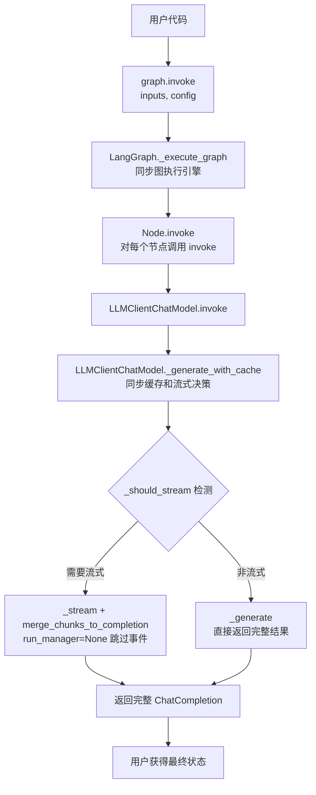
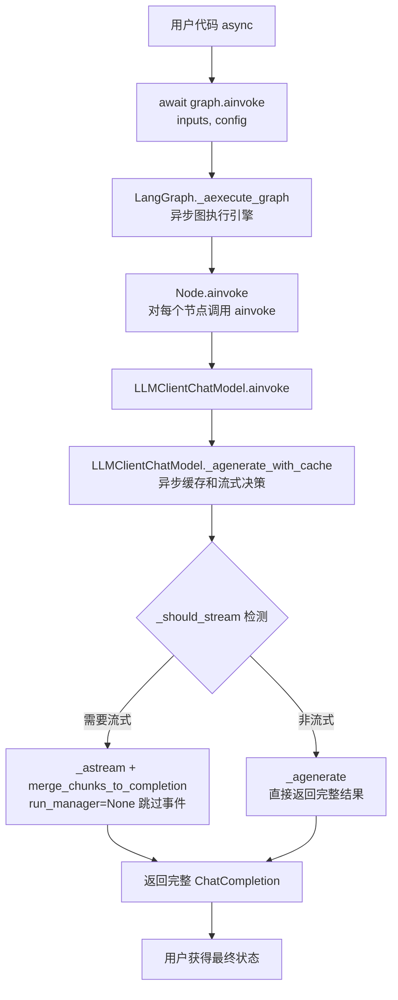
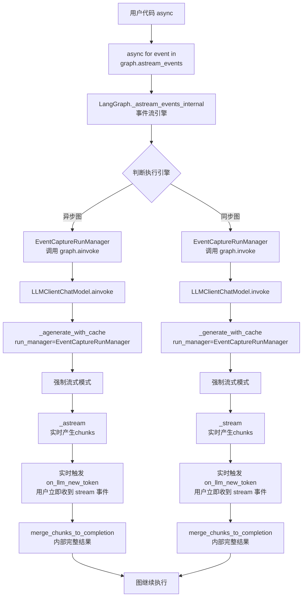

# BaseAgent 进阶开发指南

## 1.自定义 LLMClient 与 LangGraph 统一执行机制的深度集成

### 1.1 核心组件架构

#### 1.1.1 LLMClientChatModel 类结构

```python
class LLMClientChatModel(BaseChatModel):
    """将 LLMClient 包装成 LangChain ChatModel，支持自定义消息类型"""
    llm_client: LLMClient = Field(..., description="LLM客户端实例")
    
    # 核心方法
    _generate()      # 同步非流式
    _stream()        # 同步流式  
    _agenerate()     # 异步非流式
    _astream()       # 异步流式
    _generate_with_cache()    # 同步缓存和流式决策
    _agenerate_with_cache()   # 异步缓存和流式决策
```

#### 1.1.2 自定义消息类型

```python
# 支持完整的 OpenAI 原生的 ChatCompletion / ChatCompletionChunk 对象传递
ChatMessage(content="", chat_completion=response)
ChatMessageChunk(content="", chat_completion_chunk=chunk)
merge_chunks_to_completion  # 支持将ChatCompletionChunk流合并为ChatCompletion响应的函数
```

### 1.2. LangGraph 统一执行机制
 

#### 1.2.1 同步图的执行流程 (graph.invoke核心调用链)




#### 1.2.2 异步图的执行流程 (graph.ainvoke核心调用链)




#### 1.2.3 同步图/异步图的事件流执行流程 (graph.astream_events核心调用链与事件机制)



### 1.3. LangGraph 集成调用详解

#### 1.3.1. 同步图非流式调用：`graph.invoke`

```python
class MyAgent(BaseAgent):
    def _build_graph(self):
        graph = StateGraph(AgentState)
        
        def llm_node(state: AgentState):
            # 获取 LLMClientChatModel 实例
            llm_client = self.get_llm_client()
            chat_model = LLMClientChatModel(llm_client=llm_client)
            
            # 同步调用
            result = chat_model.invoke(state["messages"])
            return {**state, "response": result}
        
        graph.add_node("llm_node", llm_node)
        return graph.compile()

# 使用
agent = MyAgent()
result = agent.graph.invoke({"messages": [HumanMessage(content="Hello")]})
```

#### 1.3.2. 异步图非流式调用：`graph.ainvoke`

```python
async def llm_node(state: AgentState):
    llm_client = self.get_llm_client()
    chat_model = LLMClientChatModel(llm_client=llm_client)
    
    # 异步调用
    result = await chat_model.ainvoke(state["messages"])
    return {**state, "response": result}

# 使用
result = await agent.graph.ainvoke({"messages": [HumanMessage(content="Hello")]})
```

#### 1.3.3. 同步图/异步图流式调用：`graph.astream_events`

```python
async def run_stream(self, input_data: str, **kwargs):
    """高级流式处理实现"""
    config = {"configurable": kwargs}
    
    async for event in self.graph.astream_events(
        {"input": input_data}, 
        config=config, 
        version="v1"
    ):
        event_type = event.get("event", "")
        
        # 监听 LLM 流式事件
        if event_type == "on_chat_model_stream":
            chunk = event.get("data", {}).get("chunk")
            if chunk and hasattr(chunk, "chat_completion_chunk"):
                # 处理思考内容和普通内容
                yield self._process_stream_chunk(chunk)
        
        # 监听其他节点事件
        elif event_type.startswith("on_"):
            yield self._process_graph_event(event)
```

## 2.自定义 FinalOutput 实现流程

### 2.1. 基础输出结构定义

```python
from pydantic import BaseModel, Field
from typing import Dict, Any, List, Optional

class CustomOutput(BaseModel):
    """自定义输出结构"""
    answer: str = Field(description="主要回答")
    confidence: float = Field(description="置信度", ge=0, le=1)
    supporting_evidence: List[str] = Field(description="支持证据")
    metadata: Dict[str, Any] = Field(default_factory=dict, description="元数据")
    
    @classmethod
    def from_llm_response(cls, response: ChatCompletion) -> 'CustomOutput':
        """从 LLM 响应构建输出"""
        content = response.choices[0].message.content
        # 解析 LLM 响应，提取结构化数据
        return cls(
            answer=content,
            confidence=0.9,  # 从响应中提取或计算
            supporting_evidence=[],
            metadata={"usage": response.usage}
        )
```

### 2.2 流式 FinalOutput 处理

```python
class StreamFinalOutput(BaseModel):
    """流式最终输出"""
    type: str = Field(description="输出类型: thinking|content|final")
    content: str = Field(description="内容")
    metadata: Dict[str, Any] = Field(default_factory=dict)
    partial_result: Optional[CustomOutput] = Field(default=None)

async def run_stream_with_final_output(self, **kwargs) -> Iterator[StreamFinalOutput]:
    """支持完整 FinalOutput 的流式处理"""
    
    partial_output = CustomOutput(answer="", confidence=0.0, supporting_evidence=[])
    
    async for event in self.graph.astream_events(inputs, config=config, version="v1"):
        event_type = event.get("event", "")
        
        if event_type == "on_chat_model_stream":
            chunk = self._extract_chunk_data(event)
            
            if chunk.type == "thinking":
                yield StreamFinalOutput(
                    type="thinking",
                    content=chunk.content,
                    metadata=chunk.metadata
                )
            elif chunk.type == "content":
                # 更新部分结果
                partial_output.answer += chunk.content
                yield StreamFinalOutput(
                    type="content",
                    content=chunk.content,
                    partial_result=partial_output
                )
        
        elif event_type == "on_chain_end" and event.get("name") == "final_processing":
            # 最终输出处理
            final_data = event.get("data", {}).get("output")
            final_output = CustomOutput.from_llm_response(final_data)
            
            yield StreamFinalOutput(
                type="final",
                content="",
                metadata={"usage": final_data.usage},
                partial_result=final_output
            )
```

## 3.运行时配置系统详解

### 3.1. 配置继承与覆盖机制

```python
class AdvancedAgent(BaseAgent):
    def __init__(
        self,
        # 基础配置
        model: str = "deepseek-chat",
        temperature: float = 0.0,
        # 自定义配置
        chunk_size: int = 512,
        similarity_threshold: float = 0.8,
        max_retrieval: int = 5,
        **kwargs
    ):
        super().__init__(model=model, temperature=temperature, **kwargs)
        
        # 保存自定义配置到 init_config
        self.init_config.update({
            "chunk_size": chunk_size,
            "similarity_threshold": similarity_threshold,
            "max_retrieval": max_retrieval,
        })
        
        # 初始化自定义组件
        self.retriever = VectorRetriever(
            chunk_size=chunk_size,
            similarity_threshold=similarity_threshold
        )

    async def run(self, query: str, **runtime_config) -> Dict[str, Any]:
        """支持运行时配置覆盖"""
        
        # 合并配置：运行时配置 > 初始化配置
        effective_config = {**self.init_config, **runtime_config}
        
        # 应用配置到各个组件
        self.retriever.chunk_size = effective_config.get("chunk_size")
        self.retriever.similarity_threshold = effective_config.get("similarity_threshold")
        
        # 构建 LangGraph 配置
        graph_config = {"configurable": effective_config}
        
        result = await self.graph.ainvoke(
            {"query": query}, 
            config=graph_config
        )
        return result
```

### 3.2. 多层级配置管理

```python
class ConfigurableAgent(BaseAgent):
    def _build_graph(self):
        graph = StateGraph(AgentState)
        
        def retrieval_node(state: AgentState, config: RunnableConfig):
            """支持运行时配置的节点"""
            run_config = config.get("configurable", {})
            
            # 从运行时配置获取参数，回退到初始化配置
            chunk_size = run_config.get(
                "chunk_size", 
                self.init_config.get("chunk_size", 512)
            )
            max_retrieval = run_config.get(
                "max_retrieval",
                self.init_config.get("max_retrieval", 5)
            )
            
            # 使用配置执行操作
            results = self.retriever.retrieve(
                state["query"],
                chunk_size=chunk_size,
                max_results=max_retrieval
            )
            
            return {**state, "retrieved_docs": results}
        
        graph.add_node("retrieval", retrieval_node)
        return graph.compile()
```

## 4. 思考模式进阶配置

### 4.1 思考模式适用性分析

| 任务类型 | 推荐程度 | 原因 |
|----------|----------|------|
| **复杂推理** | ⭐⭐⭐⭐⭐ | 数学证明、逻辑推理需要展示推理链 |
| **代码调试** | ⭐⭐⭐⭐⭐ | 帮助理解问题定位过程 |
| **文档问答** | ⭐⭐⭐⭐ | 展示证据提取和推理过程 |
| **信息抽取** | ⭐⭐⭐ | 复杂 Schema 时有用 |
| **文本翻译** | ⭐ | 简单任务，不需要思考过程 |
| **文本分类** | ⭐ | 结果确定性高，不需要展示推理 |
| **关键词提取** | ⭐ | 简单任务，增加不必要的开销 |

### 4.2 流式处理中的思考内容

```python
async def process_stream_with_thinking(self, **kwargs):
    """处理包含思考内容的流式输出"""
    thinking_content = ""
    main_content = ""
    
    async for event in self.graph.astream_events(inputs, config=config, version="v1"):
        if event.get("event") == "on_chat_model_stream":
            chunk = event.get("data", {}).get("chunk")
            if chunk and hasattr(chunk, "chat_completion_chunk"):
                cc_chunk = chunk.chat_completion_chunk
                delta = cc_chunk.choices[0].delta
                
                # 区分思考内容和正常内容
                if hasattr(delta, "reasoning_content") and delta.reasoning_content:
                    thinking_content += delta.reasoning_content
                    yield {"type": "thinking", "content": delta.reasoning_content}
                elif delta.content:
                    main_content += delta.content
                    yield {"type": "content", "content": delta.content}
    
    yield {
        "type": "final",
        "thinking": thinking_content,
        "content": main_content
    }
```

### 4.3 扩展模型思考配置

配置文件位于 `llm_api/thinking_config.py`，支持以下模型：

```python
class ThinkingConfig(object):
    def __init__(self):
        self.model_type_thinking_params = {
            "glm": {
                "enable_thinking": {"thinking": {"type": "enabled"}},
                "disable_thinking": {"thinking": {"type": "disabled"}}
            },
            "deepseek": {
                "enable_thinking": {},  # DeepSeek 通过模型名称控制
                "disable_thinking": {}
            },
            "qwen": {
                "enable_thinking": {"enable_thinking": True},
                "disable_thinking": {"enable_thinking": False}
            }
        }
```

> 📌 **注意**：当前仅适配了 **OpenAI 兼容格式** 的 API 接口（如 DeepSeek、GLM、Qwen 等提供的 OpenAI 兼容端点）。如需集成 Anthropic、Google 等原生格式的 API，需要自行扩展 `LLMClient`。

**添加新模型支持**:

1. 在 `model_type_thinking_params` 中添加配置：
```python
"anthropic": {
    "enable_thinking": {"thinking": {"type": "enabled", "budget_tokens": 10000}},
    "disable_thinking": {}
}
```

2. 在 `get_model_type()` 中添加匹配规则：
```python
elif model_name.startswith("claude"):
    return "anthropic"
```

> ⚠️ **添加新模型前的必要步骤**：
> 1. 查阅目标模型 API 的官方文档
> 2. 确认该模型是否支持思考/推理模式
> 3. 了解启用思考模式所需的具体参数格式
> 4. 测试参数传递方式（可能是 `extra_body`、请求头或其他方式）
> 5. 确认是否需要特定模型版本（如 DeepSeek 的 `deepseek-reasoner`、Qwen 的 `qwen3-235b-a22b`）

### 4.4 思考模式性能考量

```python
class ThinkingAwareAgent(BaseAgent):
    """根据任务复杂度动态决定是否启用思考模式"""
    
    def should_enable_thinking(self, input_data: dict) -> bool:
        """根据输入复杂度判断是否需要思考模式"""
        text = input_data.get("text", "")
        
        # 简单规则：长文本或包含特定关键词时启用
        if len(text) > 1000:
            return True
        if any(keyword in text for keyword in ["为什么", "如何", "分析", "推理"]):
            return True
        return False
    
    async def run(self, **kwargs):
        # 动态决定是否启用思考模式
        enable_thinking = self.should_enable_thinking(kwargs)
        
        # 创建运行时配置
        runtime_config = {**kwargs, "enable_thinking": enable_thinking}
        
        # 记录决策
        self.logger.info(f"思考模式: {'启用' if enable_thinking else '禁用'}")
        
        return await self._execute(runtime_config)
```

---

本指南展示了如何深度定制 BaseAgent，特别是与 LangGraph 的集成、流式处理、运行时配置系统和思考模式的高级用法。这些模式可以帮助构建生产级的智能体应用。

